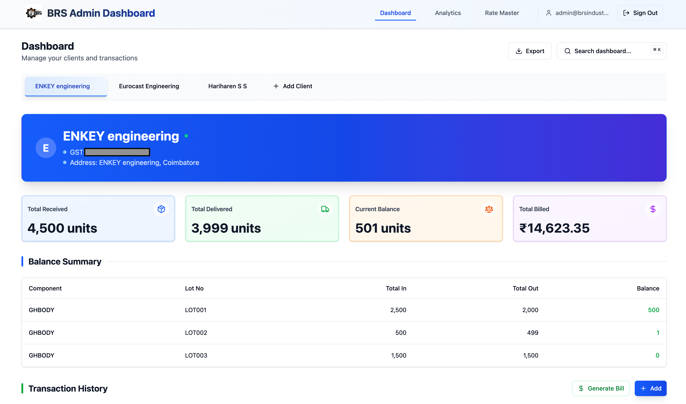
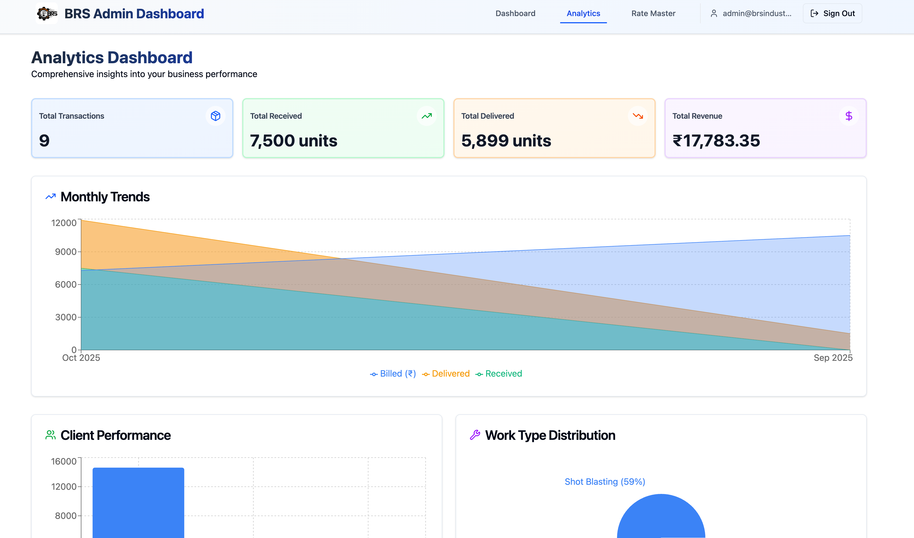
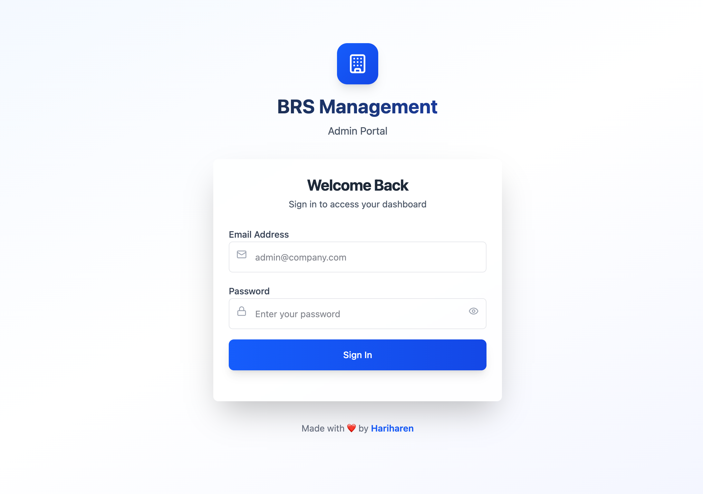
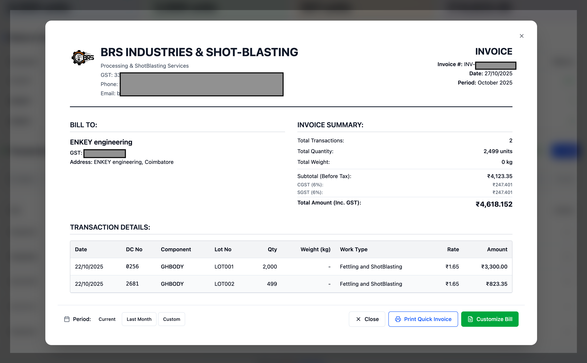
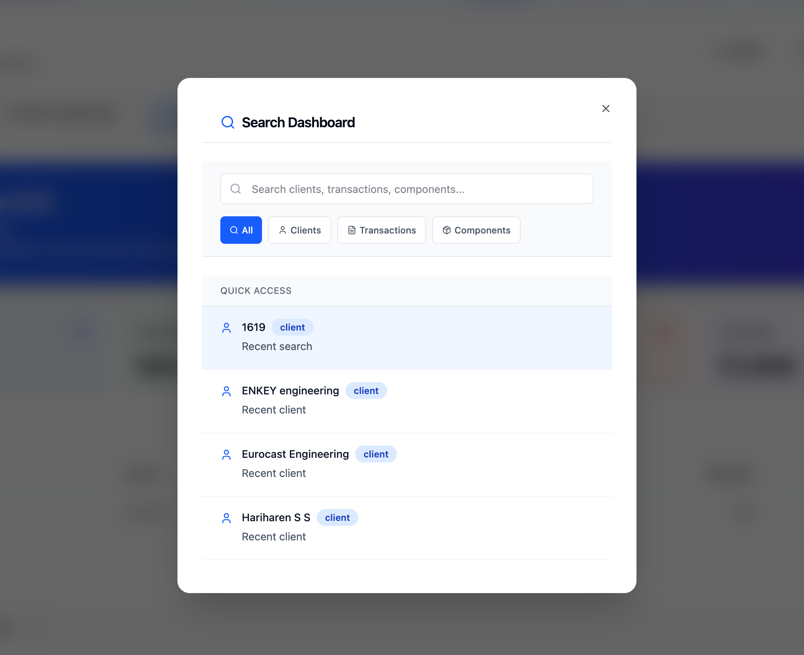
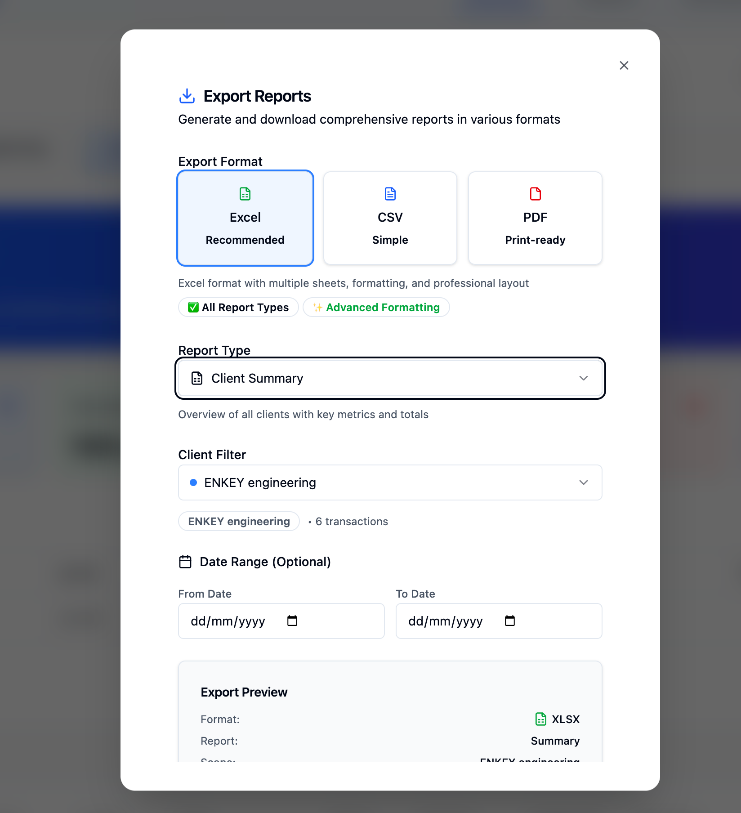

# BRS Management System:

## Revolutionizing Your Operations, Driving Your Success

The BRS Management System is more than just software; it's a strategic investment in the efficiency and future of BRS Industries. Custom-built to your unique operational needs, this system replaces outdated, manual processes with a powerful, real-time, and centralized solution. It's designed not just to solve today's challenges, but to be a scalable platform for tomorrow's growth.

## A Glimpse into Your New Workflow

## Screenshots

| Dashboard | Analytics |
| :---: | :---: |
|  |  |

| Admin Login | Bill Generator |
| :---: | :---: |
|  |  |

| Global Search | Export |
| :---: | :---: |
|  |  |

### Breaking Free from the Limitations of Spreadsheets

Your previous Excel-based workflow was a bottleneck, hindering your ability to operate at peak efficiency. It created:
*   **Critical Data Silos**: Information was fragmented across different files and versions, leading to costly inconsistencies.
*   **Revenue-Draining Errors**: Manual data entry and complex calculations were a constant source of errors, impacting your bottom line.
*   **Lack of Strategic Insight**: Without real-time data, it was impossible to get an accurate, up-to-the-minute view of your operations for strategic decision-making.
*   **Wasted Time and Resources**: Countless hours were spent on manual data entry, reconciliation, and report generation.

### The BRS Management System: A Competitive Advantage

This system is your new central hub for operations, delivering a significant competitive advantage:
*   **Absolute Data Integrity**: A single source of truth eliminates conflicts and ensures everyone is working with the most current, accurate data.
*   **Operational Excellence**: Streamlined and validated data entry minimizes errors, saves valuable time, and frees up your team to focus on core business activities.
*   **Real-Time Business Intelligence**: Live dashboards provide instant visibility into your most important KPIs, empowering you to make proactive, data-driven decisions.
*   **Flawless, Automated Billing**: Increase accuracy and improve cash flow with a fully automated billing process that applies client-specific rates without manual intervention.

## Core Benefits at a Glance

- **Command Your Business from a Central Dashboard**: Effortlessly manage all your clients and operations from one intuitive interface.
- **Monitor Your Business Health in Real-Time**: Keep a constant pulse on your KPIs—Total Received, Delivered, Balance, and Billed amounts.
- **Achieve Total Inventory Control**: Maintain a precise, component- and lot-level view of your entire inventory.
- **Simplify Your Transactions**: Log material receipts and deliveries with just a few clicks.
- **Maximize Billing Accuracy**: Eliminate costly errors with a dynamic and fully automated billing system.
- **Experience a Seamless, Modern Interface**: A clean, responsive, and mobile-first design ensures ease of use for everyone on your team.

## The BRS Difference: A New Era of Efficiency

| Capability | Old Excel Workflow | BRS Management System |
| :--- | :--- | :--- |
| **Data Integrity** | Fragmented & Unreliable | Centralized & 100% Accurate |
| **Operational Speed** | Manual & Slow | Automated & Instant |
| **Business Insight** | Delayed & Incomplete | Real-Time & Comprehensive |
| **Billing Process** | Error-Prone & Manual | Automated & Flawless |
| **Future Potential** | Stagnant | Scalable & Future-Ready |

## Built for Today, Ready for Tomorrow

This system is built on a modern, robust, and scalable technology stack, ensuring it can grow and adapt with your business.

- **Frontend**: React 18 + TypeScript + Vite
- **UI Components**: Shadcn/ui + Tailwind CSS
- **Backend**: Supabase (PostgreSQL + Real-time + Auth)

### Your Platform for Future Growth

The BRS Management System is not just a finished product; it's a foundation. The modular architecture makes it easy to add new features and capabilities as your business evolves. Future possibilities include:

*   **Advanced User Roles and Permissions**
*   **Customer-Facing Portal**
*   **Deeper Analytics and Predictive Reporting**
*   **Integration with Accounting Software**

This system is an investment in a more efficient, profitable, and scalable future for BRS Industries.

## System Requirements

- A modern web browser (Chrome, Firefox, Safari, or Edge).
- An internet connection.

## License

This project is proprietary and all rights are reserved. See the [LICENSE](LICENSE) file for details.